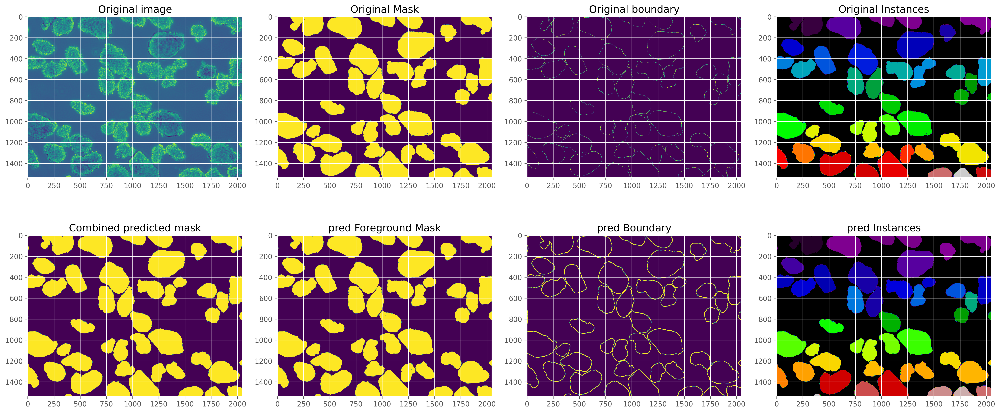
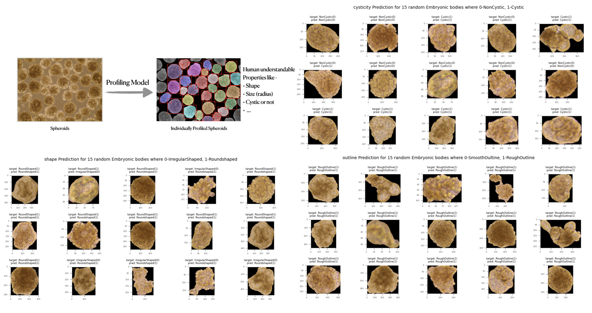

# Project Overview

This project focuses on developing a computer vision solution using Deep Learning for the analysis of embryonic tissues. The solution is implemented using PyTorch and consists of a two-phase model: Segmentation and Profiling.

## 1. Segmentation Phase
- Dynamic UNet Architecture from scratch: Designed to process high-resolution microscopy images, enabling precise segmentation of embryonic tissues.

## 2. Profiling Phase
- Custom CNN Model: Built to accommodate variable image resolutions, allowing for the extraction of multiple tissue properties from segmented images.

- Interactive Annotation Tool: Developed a [Annotation tool](https://github.com/Sabya2/EmbryonicBodyAnnotation) to facilitate biologists in annotating tissue properties, ensuring high-quality data for model training. 

